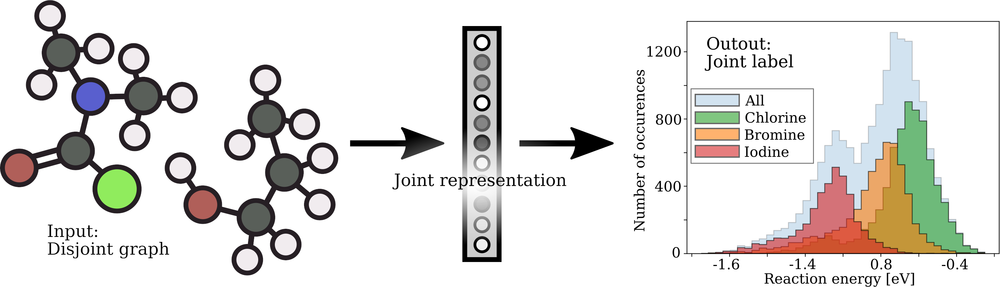

## GraphReactionNet


<p align="center">


Reference implementation of the certificates proposed in the paper:

["Efficient Robustness Certificates for Discrete Data: Sparsity-Aware Randomized Smoothing for Graphs, Images and More"](https://arxiv.org/abs/2008.12952)

Chen Shao, Chen Zhou, and Pascal Friederich

## Example
The notebook demo.ipynb shows an example of how to use our binary certificate for a pretrained GCN model. 

You can use `scripts/train_and_cert.py` to train and certify a model from scratch on a cluster using [SEML](https://github.com/TUM-DAML/seml).

## Cite
Please cite our paper if you use this code or dataset in your own work:

```
@inproceedings{bojchevski_sparsesmoothing_2020,
title = { Graph neural networks to learn joint representations of disjoint molecular graphs},
author = {Chen Shao, Chen Zhou, and Pascal Friederich},

}
```